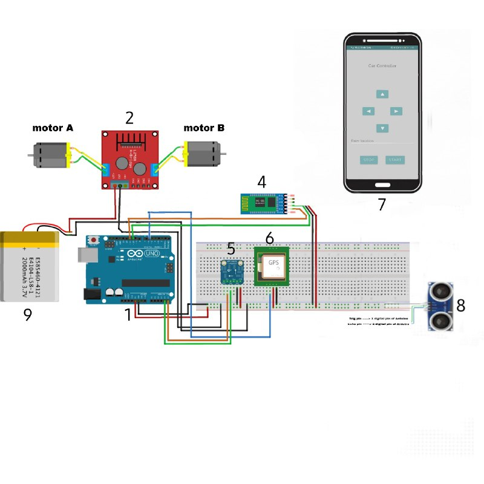
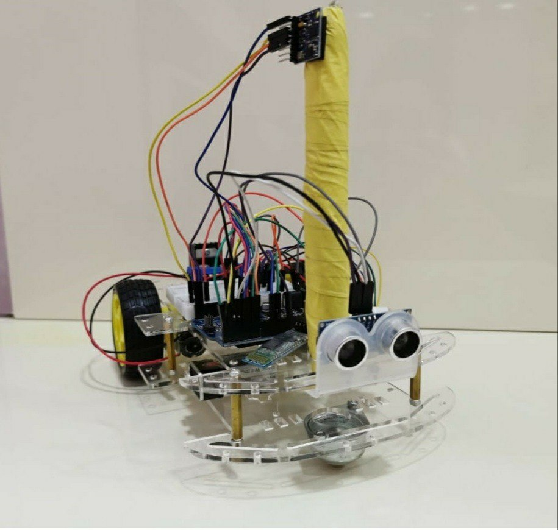

# autoCar

<!--
*** Thanks for checking out the Best-README-Template. If you have a suggestion
*** that would make this better, please fork the repo and create a pull request
*** or simply open an issue with the tag "enhancement".
*** Thanks again! Now go create something AMAZING! :D
-->

<!-- PROJECT SHIELDS -->
<!--
*** I'm using markdown "reference style" links for readability.
*** Reference links are enclosed in brackets [ ] instead of parentheses ( ).
*** See the bottom of this document for the declaration of the reference variables
*** for contributors-url, forks-url, etc. This is an optional, concise syntax you may use.
*** https://www.markdownguide.org/basic-syntax/#reference-style-links
-->
[![Contributors][contributors-shield]][contributors-url]
[![Issues][issues-shield]][issues-url]
[![MIT License][license-shield]][license-url]

<!-- ABOUT THE PROJECT -->
## About The Project

This is a project made by [Salma Musa Eid](https://github.com/slamamusa) and [Rawan Kamal Mustafa](https://github.com/0Rawan).
AutoCar created with Arduino to make a car move autonomously, it can be a great start to autonomous vehicle projects, and it can work as a small delivery vehicle.

### Built With
* [Java](https://java.com)
* [C++](https://cplusplus.com)
* [Arduino](https://arduino.cc)
* [Android studio](https://developer.android.com/studio)

<!-- GETTING STARTED -->
## Getting Started
To be able to test the project on your own follow the following instructions

### Prerequisites
Android studio
Aruino IDE

## Usage

we recommend that if you willing to tweak the app on your machine to download the `autoCar/AutoCar/app/src/main/res` folder and `autoCar/AutoCar/app/src/main/java/com/example/autocar` to avoid compatibility errors in Android studio.

For arduino code download it directly.

<!-- LICENSE -->
## License

Distributed under the  Apache License. See `LICENSE` for more information.

<!-- ACKNOWLEDGEMENTS -->
## Acknowledgements
* [Arduino-Bluetooth-Basic](https://github.com/Mayoogh/Arduino-Bluetooth-Basic)
* [circuitcellar](https://circuitcellar.com/cc-blog/gps-guides-robotic-car-2/)

<!-- MARKDOWN LINKS & IMAGES -->
<!-- https://www.markdownguide.org/basic-syntax/#reference-style-links -->
[contributors-shield]: https://img.shields.io/github/contributors/0Rawan/autoCar.svg?style=for-the-badge
[contributors-url]: https://github.com/0Rawan/autoCar/graphs/contributors
[forks-shield]: https://img.shields.io/github/forks/othneildrew/Best-README-Template.svg?style=for-the-badge
[stars-shield]: https://img.shields.io/github/stars/othneildrew/Best-README-Template.svg?style=for-the-badge
[stars-url]: https://github.com/othneildrew/Best-README-Template/stargazers
[issues-shield]: https://img.shields.io/github/issues/0Rawan/autoCar.svg?style=for-the-badge
[issues-url]: https://github.com/othneildrew/Best-README-Template/issues
[license-shield]: https://img.shields.io/github/license/0Rawan/autoCar.svg?style=for-the-badge
[license-url]: https://github.com/0Rawan/autoCar/LICENSE.txt
